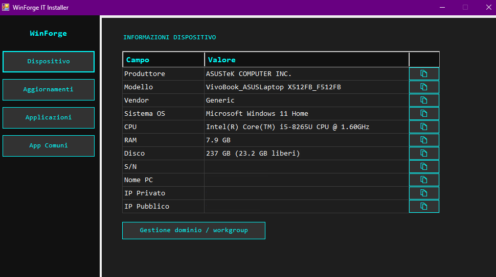
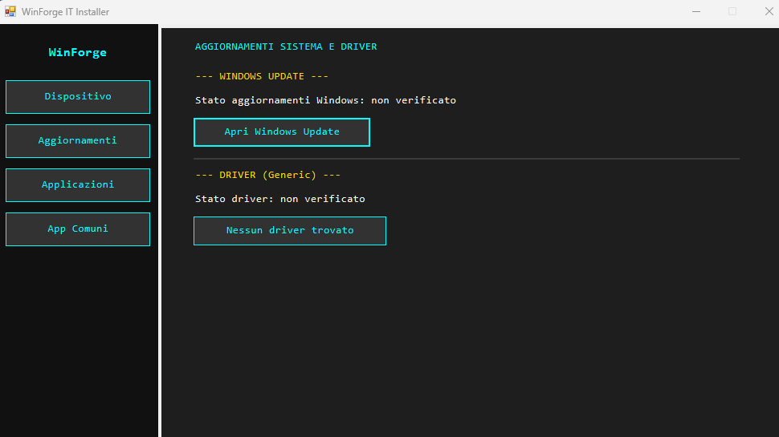
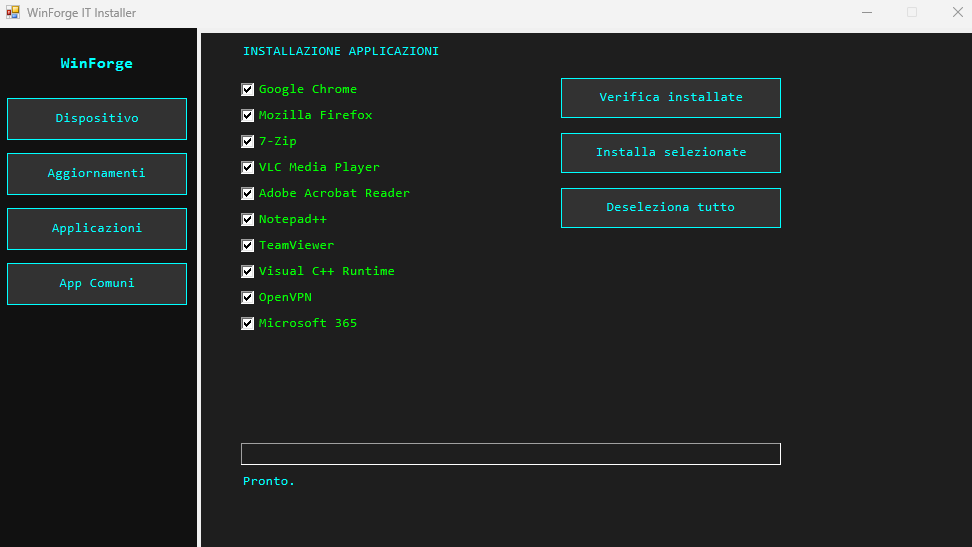
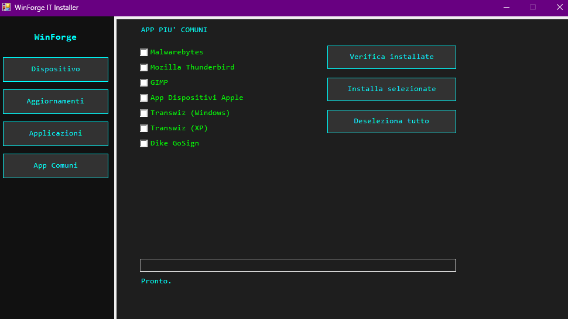

# WinForge

> **Automated Windows workstation provisioning & inventory tool**
> One-click setup, driver management and software deployment for Windows endpoints.


---

> ⚠️ **Important — before you run it**
> If WinForge fails to launch (or the App Installer / `winget` step errors out immediately), **run Windows Update first** and install all pending updates, then reboot. WinForge depends on a recent `App Installer` (winget) and an up-to-date `.NET` stack, which a long-unpatched Windows installation may be missing.

---

## Why this exists

Every time you set up a new Windows PC for a colleague — or reinstall one after a wipe — you run the same 30-minute ritual. Hunt down the manufacturer's driver utility. Accept five EULAs. Install Chrome, install 7-Zip, install Acrobat. Set the default browser. Copy the serial number into a ticket. Find the public IP for the firewall guy. Repeat next week on a different PC.

**WinForge** folds that ritual into a single PowerShell GUI. Plug the PC in, click through four tabs, and a workstation that used to take 2–3 hours of attended work is ready in roughly **15 minutes** of mostly-unattended runtime.

It's **vendor-aware** (Dell, HP and Lenovo each get a different driver flow), **idempotent** (it won't reinstall what's already there), and **resilient** (every download has a browser fallback, every installer call has retry logic for "installer busy" errors). The whole thing is a single `.ps1` file with no external dependencies — drop it on the desktop, double-click the `.bat` launcher, done.

---

## Screenshots

<table>
<tr>
<td width="50%">

<p align="center"><i>Device tab — hardware inventory with one-click clipboard copy</i></p>
</td>
<td width="50%">

<p align="center"><i>Updates tab — Windows Update and vendor-aware driver flow</i></p>
</td>
</tr>
<tr>
<td width="50%">

<p align="center"><i>Applications tab — corporate baseline catalogue</i></p>
</td>
<td width="50%">

<p align="center"><i>Common Apps tab — extra software for end-user customisation</i></p>
</td>
</tr>
</table>

> The UI labels are currently in Italian. English localization is on the [roadmap](#roadmap).

---

## What it does

### Tab 1 — Device

Full hardware and network inventory, displayed in a `DataGridView` with per-row clipboard buttons (Segoe MDL2 icons that animate to a green check for 1.2 s on click).

Captured fields:

- Manufacturer, model, normalized vendor (Dell / HP / Lenovo / Generic)
- OS, CPU, RAM, total and free disk space
- BIOS serial number
- Hostname
- Private IP (loopback and well-known addresses filtered out)
- Public IP with **fallback across 3 services** (ipify, ifconfig.me, AWS checkip) and regex validation

A direct button to `sysdm.cpl` for domain / workgroup management.

### Tab 2 — Updates

- **Windows Update**: shortcut to `ms-settings:windowsupdate`
- **Vendor-aware driver flow**:
  - 🟦 **Dell** → three dedicated buttons:
    - **.NET Desktop Runtime 8.0** (Dell Command Update prerequisite): registry-based detection, silent install from Microsoft's official CDN if missing
    - **Dell Command Update**: opens the official Dell driver page with on-screen instructions
    - **Dell SupportAssist**: direct download from `downloads.dell.com` with `MZ` header validation, browser fallback on failure
  - 🟥 **HP** → installs HP Support Assistant via `winget`
  - 🟩 **Lenovo** → installs Lenovo System Update via `winget` + silent execution of `/CM -search A -action INSTALL`
  - ⚪ **Generic** → notifies the user that no managed driver channel exists for this hardware

### Tab 3 — Applications

Corporate baseline catalogue with pre-checked items:

| Default ON                                                                                                          |
| ------------------------------------------------------------------------------------------------------------------- |
| Chrome, Firefox, 7-Zip, VLC, Acrobat Reader, Notepad++, TeamViewer, Visual C++ 2015+ Runtime, OpenVPN, Microsoft 365 |

**Already-installed detection**: cross-references `winget list` output (written to a temp file, polled with `DoEvents` so the UI stays responsive) with typical install paths. Apps already present are disabled and tagged `[gia installata]`.

**Installation**: progress bar, colored status label (gold = working, lime green = OK, red = error), detailed log.

**Special cases**:

- **TeamViewer** → direct download from the official CDN + silent install (`/S`), browser fallback on error
- **Microsoft 365** → `curl.exe` download from `go.microsoft.com/fwlink`, `MZ` header validation, browser fallback

**Retry logic**: when `winget` exits with code **1618** (`ERROR_INSTALL_ALREADY_RUNNING`), WinForge waits 20 seconds and retries up to 3 times.

### Tab 4 — Common Apps

Less frequent software that's still handy to have one click away:

| Via winget                                              | Direct download                                                |
| ------------------------------------------------------- | -------------------------------------------------------------- |
| Malwarebytes, Thunderbird, GIMP, Apple Devices App      | Transwiz (Windows), Transwiz (XP), Dike GoSign                 |

Same detection + retry pattern as Tab 3.

---

## Requirements

- Windows 10 (1809+) or Windows 11
- PowerShell 5.1+ (preinstalled on Windows)
- Administrator privileges (UAC auto-elevation is built in)
- App Installer (`winget`) — already present on Windows 11. WinForge resolves the real path to `winget.exe` under `Program Files\WindowsApps` because the generic alias can fail with redirected stdout under elevated context
- Internet connection (for `winget` and vendor driver downloads)

No external dependencies, no extra PowerShell modules to install.

---

## Installation and usage

### Option A — Run directly

```powershell
# From PowerShell — UAC elevation will be requested automatically
.\WinForge.ps1
```

### Option B — Double-click

Double-click `WinForge.bat`. It's a small launcher that calls PowerShell with `-ExecutionPolicy Bypass` on the adjacent `.ps1` file.

### Option C — Recommended IT technician workflow

1. Run `WinForge.bat` on a freshly imaged PC
2. **Device tab** → copy the serial number and IPs into the ticket / CMDB
3. **Updates tab** → on Dell, run the three buttons in order; on HP/Lenovo, one click is enough
4. **Applications tab** → "Check installed", then "Install selected"
5. **Common Apps tab** → optional, based on end-user needs
6. Final reboot → workstation ready for handoff

---

## Architecture

WinForge is a **single-file PowerShell script** (~1080 lines) organised into logical sections:

```
WinForge.ps1
├── UAC auto-elevation
├── Get-WingetPath           → resolves the real path of winget.exe via Get-AppxPackage
├── File logging             → Desktop\WinForge_install_log.txt
├── Hardware detection       → CIM/WMI
├── Connectivity check       → retry loop with retry/cancel dialog
├── winget sources update    → 30 s timeout, non-blocking
├── Windows Forms UI (dark theme, multi-tab)
│   ├── Tab Device           → DataGridView with animated clipboard buttons
│   ├── Tab Updates          → vendor-specific logic (3 buttons for Dell)
│   ├── Tab Applications     → winget + custom handlers + shortcuts + 1618 retry
│   └── Tab Common Apps      → winget + direct downloads for custom software
└── Self-cleanup on exit
```

### Notable technical choices

- **`Get-WingetPath`**: resolves the real path of `winget.exe` under `Program Files\WindowsApps` via `Get-AppxPackage Microsoft.DesktopAppInstaller`. The generic alias can fail when stdout is redirected in an elevated context — this avoids a class of subtle "winget not found" errors
- **`DoEvents` polling** instead of `Start-Job`: the UI stays responsive during long `winget` calls without the marshalling complications of cross-runspace job communication
- **Exit code 1618 retry logic** (`ERROR_INSTALL_ALREADY_RUNNING`): when the Windows Installer service is busy with another package, WinForge waits 20 s and retries up to 3 times — handles the "installer busy" race condition that affects any batch installer
- **`MZ` header validation** on binaries downloaded via `curl.exe`: if the first two bytes aren't `4D 5A`, the file isn't a valid PE executable → falls back to opening the vendor's download page in the browser
- **TLS 1.2 forced** on every `WebClient` call for compatibility with modern endpoints
- **`DataGridView` with animated clipboard cells**: the copy icon (Segoe MDL2 `0xE8C8`) switches to a green check (`0xE73E`) for 1.2 s after a click, via a one-shot `System.Windows.Forms.Timer`
- **"Single-page with view router" pattern**: a hidden `TabControl` (header height set to 1 px) is driven by side-menu buttons that set `SelectedIndex`. The result feels like a real dashboard while staying within plain Windows Forms
- **Partial idempotency**: detected installs are disabled and tagged `[gia installata]` to prevent redundant work, even across reruns within the same session
- **Self-cleanup**: a detached `cmd` process with `timeout 2` removes `C:\WinForge\` after exit — a PowerShell script can't delete itself while it's running, so a separate process is the only reliable way

---

## Log

Every operation is timestamped and written to:

```
%USERPROFILE%\Desktop\WinForge_install_log.txt
```

Example:

```
2026-05-23 14:22:01 === Installer started ===
2026-05-23 14:22:08 winget updated
2026-05-23 14:24:15 Runtime install started
2026-05-23 14:25:02 .NET Desktop Runtime 8.0 installed
2026-05-23 14:26:48 Dell Command Update download page opened in browser
2026-05-23 14:28:11 Installing: Google.Chrome
2026-05-23 14:28:34 winget Google.Chrome exit=0
2026-05-23 14:29:30 Shortcut created: Google Chrome
2026-05-23 14:31:12 Exit 1618 on Microsoft.VCRedist.2015+.x64, retry 1
2026-05-23 14:31:55 winget Microsoft.VCRedist.2015+.x64 exit=0
```

---

## Troubleshooting

### WinForge fails to launch, or closes immediately

**This is almost always a Windows-Update issue.** WinForge relies on `winget` (App Installer) and a working .NET runtime stack — on a long-unpatched Windows installation, one or both can be missing or broken.

**Fix:**

1. Open `Settings → Windows Update`
2. Click **Check for updates** and install everything pending (including optional and driver updates)
3. **Reboot the PC**
4. Re-launch `WinForge.bat`

If the issue persists after a fully patched Windows:

- Open the Microsoft Store, search for **App Installer**, and click **Update**
- Verify `winget --version` from a regular PowerShell window returns a version
- Check the log at `Desktop\WinForge_install_log.txt` for the last entry before the crash

### "winget.exe not found" error dialog at startup

The `App Installer` package isn't installed. Install it from the Microsoft Store ([direct link](https://apps.microsoft.com/detail/9NBLGGH4NNS1)) or via PowerShell:

```powershell
Add-AppxPackage -RegisterByFamilyName -MainPackage Microsoft.DesktopAppInstaller_8wekyb3d8bbwe
```

### SmartScreen warning on first run

WinForge is not code-signed yet. On first launch, Windows SmartScreen may show "Windows protected your PC". Click **More info → Run anyway**. This is on the roadmap.

### Some apps stay unchecked after "Check installed"

The detection cross-references `winget list` output with hardcoded install paths. If you installed an app to a non-standard location, the path check fails. You can still tick the box manually — `winget` itself is idempotent and will recognise the existing install.

---

## Roadmap

- [ ] Extract the app catalogue into an external JSON file
- [ ] POST log to a central reporting endpoint
- [ ] **English localization of the UI** (currently Italian only)
- [ ] Code signing to avoid SmartScreen warnings
- [ ] OEM bloatware removal module
- [ ] Preset profiles (Office worker / Developer / Kiosk)

---

## License

MIT — see [`LICENSE`](LICENSE) for details.

---

## Author

**Lorenzo Boschi**
Built as an operational tool for provisioning Windows workstations in SOHO and SMB environments.

Pull requests and issue reports are welcome.
